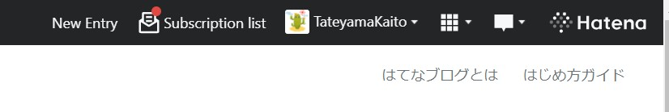
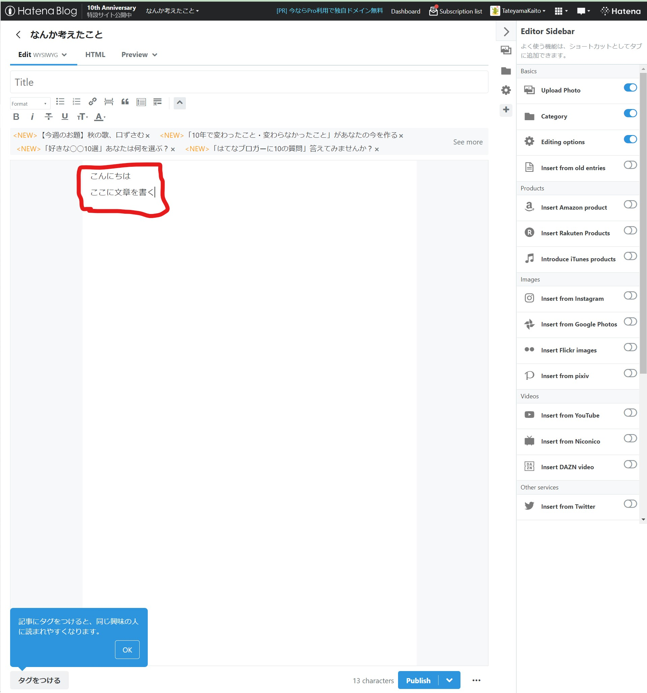

# 完成形のイメージ

今回作るものはブログです。Webサービスでブログが書けるものはたくさんありますが、例えば [はてなブログ](https://hatenablog.com/) を見てみましょう。

「New Entry」というボタンを押すとブログの記事を新規に書き始めることができます。

以下の赤枠部分にブログの記事の文章を書いて、「Publish」ボタンを押すと記事が世の中に公開されます。

このように、ブログを作るときには以下の機能があればよさそうです。

- ブログを書く編集画面
- ブログを表示する画面

実際には会員登録の機能などが必要です。しかしここでは一旦コア機能を実装してしまってから考えることにしましょう。このように、サービスの中心的な価値を届ける最小限のプロダクトをMVP(Minimum Viable Product)ということもあります。

**最小限のMVPをまず完成させることを目指しましょう。**

## 確認テスト

- [ ] 完成形のイメージが湧きましたか？
