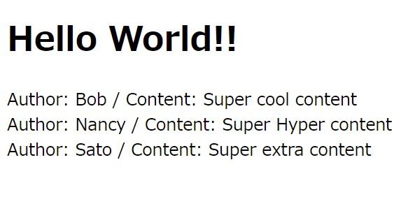

# 開発環境にアクセスできることを確認する

ここでは、以下のことができればOKです。

- gitを導入し、GitHubにWSLの方でつながるようにする。
- GitHubからblogの雛形を取ってきて、WSLの方でdocker、docker-composeを用いて立ち上げる。
- npmを導入し、フロントエンドサーバを立ち上げる。

## 手順: gitの導入とGitHubへの疎通

- GitHubは、自分のソースコードを世界に公開するためのプラットフォームです。最近はインターンや就活で、自分はこれまでこんなことやってきました！と自分の実力や興味関心を伝える手段としても重要視されてきている気がします。積極的に使っていきましょう。
- gitにnameとemailを登録します。nameはGitHubのアカウント名、emailはGitHubに登録するときに使ったものを使ってください

```
git config --global user.name "自分の名前"
git config --global user.email "メール@example.com"
```

次にWSL側では、鍵を生成します。

```
mkdir ~/.ssh
cd ~/.ssh
ssh-keygen -t rsa
```

Nameは`github_key`, passphraseは指定しなくていいです。

`~/.ssh`を確認します。

```
ls
```

ファイルがあればOKです。

権限を変更します

```
chmod 600 github_key
```

次に、GitHub側に公開鍵を伝えます

```
cat github_key.pub
```

出てきた内容をコピーして、GitHub>Settings>SSH and GPG keys>New SSH Keyから追加。

configを作ります

```
touch config
code ./config
```

configに書き込む内容

```
Host github.com
    HostName github.com
    PreferredAuthentications publickey
    IdentityFile ~/.ssh/github_key
```

configの権限を変更します

```
chmod 600 config
```

sshが通るか確認します

```
ssh -T git@github.com
```

`Hi <username>! You've successfully authenticated, but GitHub does not provide shell access.`みたいなのが出たらOKです。お疲れさまでした。

うまくいかない場合は、エラーメッセージを調べてみて15分たっても分からなければ質問してみましょう。

## 手順: dockerでblogの雛形を立ち上げて確認する

blogの雛形はこちらです。[hu-hicoder/blog:handson](https://github.com/hu-hicoder/blog/tree/handson) ここでは、handsonブランチを使います。

はじめに、`git clone`でblogの雛形を取ってきます。

```
cd ~
git clone -b handson git@github.com:hu-hicoder/blog.git
cd blog
ls
```

以下のような表示がされていればOKです。

```
$ ls
blog-editor  blog-public  blog-style  LICENSE  README.md
```

では、続いてdocker, docker-composeを使ってプロジェクトを立ち上げます。

```
cd blog-public/scripts/docker/
sudo docker-compose up
```

以下のような表示がされていればOKです。

```
...(省略)...
docker-backend-1  |    ____    __
docker-backend-1  |   / __/___/ /  ___
docker-backend-1  |  / _// __/ _ \/ _ \
docker-backend-1  | /___/\__/_//_/\___/ v4.6.1
docker-backend-1  | High performance, minimalist Go web framework
docker-backend-1  | https://echo.labstack.com
docker-backend-1  | ____________________________________O/_______
docker-backend-1  |                                     O\
docker-backend-1  | ⇨ http server started on [::]:3001
```

ブラウザで [http://localhost:3000/](http://localhost:3000/) にアクセスしてみてください。以下のような表示がされていればOKです。


サーバを落とすときは、`Ctrl+c`で止めた後に

```
docker-compose down
```

としてください。

## 手順: npmを導入し、フロントエンドサーバを立ち上げる

前回のdockerではデータベース用のサーバとバックエンド用のサーバが立ち上がっています。フロントエンドだけはDockerでの開発が向かないと思われるので、別で立ち上げます。

まず、npmというフロントエンド開発のためのツールを導入します。今回はこのツールを[nodebrew](https://github.com/hokaccha/nodebrew)経由でインストールします。

```
curl -L git.io/nodebrew | perl - setup
code ~/.bashrc
```

bashrcを開いたら、以下を一番後ろに追記します。

```
export PATH=$HOME/.nodebrew/current/bin:$PATH
```

そしてターミナルで以下を実行します

```
source ~/.bashrc
```

これで設定は完了です。npmをインストールします。基本的に`ls, ls-remote, install-binary, use`を覚えていればよいです。詳しくは[公式ページ](https://github.com/hokaccha/nodebrew)を見てください。

```sh
# node,npmの検索
nodebrew ls-remote
# バージョンを選んでインストール
nodebrew install-binary v16.13.0
# ローカルで使うバージョンを指定
nodebrew use v16.13.0
```

インストールが成功したか確認します。

```
node -v
```

以下のように表示されていればOKです。

```
$ node -v
v16.13.0
```

別のターミナルで`docker-compose up`している状態で、もう一つターミナルを立ち上げて

```
cd blog-public/frontend
npm i
npm run dev
```

としてフロントエンドサーバを立ち上げます。ブラウザで [http://localhost:8080/](http://localhost:8080/)にアクセスし、以下のように表示されていればOKです



サーバを止めるときは`Ctrl+c`でOKです。バックエンドのdockerも落とすことを忘れずに。

## 確認テスト

- [ ] gitを導入し、GitHubにつながることを確認した
- [ ] dockerでblogの雛形を立ち上げて、ブラウザでアクセスして確認した
- [ ] npmを導入して、フロントエンドサーバを立ち上げた