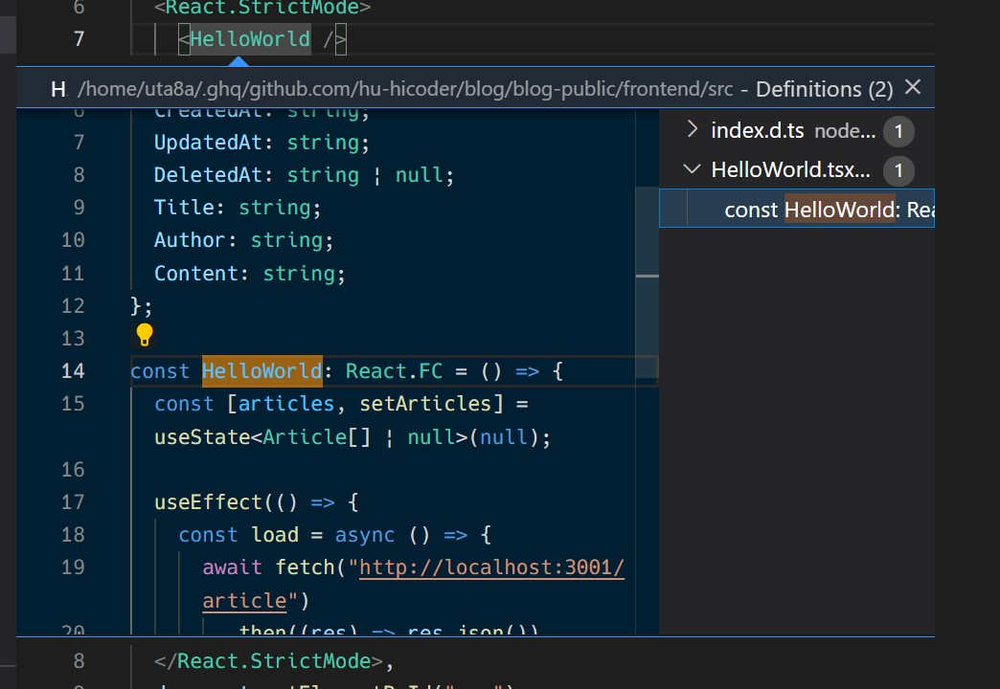

# 初めに何からコードを読んでいけばいいのか知る

ここでは、実際のフロントエンドのコードを読んでいきます。

フロントエンドのプロジェクトは [blog/blog-public/frontend](https://github.com/hu-hicoder/blog/tree/handson/blog-public/frontend) にあります。

このフロントエンドのプロジェクトでは、[npm](https://www.npmjs.com/) というパッケージ管理ツールを使用しています。また、言語は[TypeScript](https://github.com/microsoft/TypeScript) ( `.ts`, `.tsx` )を主に使っていきます。

npmや、yarnといったパッケージマネージャを使っていることが分かっていたら、 `package.json` という名前のファイルをまず初めに見ていくとよいでしょう。

## package.json を読む

[blog-public/frontend/package.json](https://github.com/hu-hicoder/blog/blob/handson/blog-public/frontend/package.json) を開いて見てみましょう。

これはJSONという形式で開発時の設定が書かれています。色々なことが書かれていますが、今回は [`scripts`](https://github.com/hu-hicoder/blog/blob/8c46b2c1abe519114d9ade779042fc8cc0fe5a78/blog-public/frontend/package.json#L6-L8) の項目だけ着目します。

ここには開発時のコマンドが書かれていて、自分で定義することができます。フロントエンドサーバを手元で立ち上げるときに `webpack-serve` というソフトウェアを使って `npx webpack serve --config webpack.config.js` のようにしてフロントエンドサーバを立ち上げているのですが、毎回このコマンドを打ち込むのは面倒です。そこで、このコマンドに `dev` というエイリアス(別名を割り当てる)をつけてあげて `npm run dev` というコマンドで簡単にフロントエンドサーバを立ち上げて開発できるようにしています。

あとは `devDependencies` や `dependencies` では外部のライブラリを使っています。`devDependencies` は開発のときにしか使わないので最終的に本番環境にビルドするときには含まれず、 `dependencies` は本番環境にビルドする成果物に含まれます。これは後で機能追加を行うときに使う知識なので覚えておきましょう。

これはプロジェクトごとに違いますが、今回は `src` ディレクトリの中にコードの本体があるのでそこを見ていきましょう。

## srcの中を読む: app.tsxを読む

[blog-public/frontend/src](https://github.com/hu-hicoder/blog/tree/handson/blog-public/frontend/src) を開いて見てみましょう。

index.htmlというHTMLファイルを開くと、`id`が`app`のdiv要素がひとつだけあることが分かります。Reactは、このdiv要素に対して作用し、このdiv要素の中で文章を表示したり、ボタンを配置したりといったUI操作を行います。その作用するコードはどこかというと、[`app.tsx`](https://github.com/hu-hicoder/blog/blob/handson/blog-public/frontend/src/app.tsx) の中の`ReactDOM.render`にあたります。

```ts
ReactDOM.render(
  <React.StrictMode>
    <HelloWorld />
  </React.StrictMode>,
  document.getElementById("app") // ここでid=appの要素に対し作用している
);
```

コードを読んでいくときは、VSCodeのコードジャンプを使うと楽です。Ctrlを押しながら知らない単語をクリックすると、そのコードが宣言されている場所に飛ぶことができます。(できないときもあります)

例えば、`<HelloWorld />` をCtrlを押しながらクリックしてみたときの様子です。



ポップアップが表示されて、`HelloWorld`が宣言されている場所が表示されています。こうしてどんどん知らない変数は調べていきましょう。

また、調べ方としては `import` を見るという手もあります。`import` は別ファイルで宣言された変数や関数をこのファイルで使います、という意味なので、定義を見るために別ファイルを見に行きましょう。

今回は `HelloWorld.tsx` を見ていきます。`react`と`react-dom`は外部ライブラリなので、`src`内にはありません。

## srcの中を読む: HelloWorld.tsxを読む

[`HelloWorld.tsx`](https://github.com/hu-hicoder/blog/blob/handson/blog-public/frontend/src/HelloWorld.tsx) を開いて見ていきましょう。

ここでは詳しく立ち入りませんが、以下のキーワードを調べて理解すれば大丈夫です。もちろん、15分調べて分からなければdiscordで尋ねてみましょう。

- [`type`](https://typescript-jp.gitbook.io/deep-dive/type-system#eiriasutype-alias)
- [`const`](https://developer.mozilla.org/ja/docs/Web/JavaScript/Reference/Statements/const)
- [`useState`, `useEffect`](https://ja.reactjs.org/docs/hooks-intro.html)
- [`async`, `await`](https://developer.mozilla.org/ja/docs/Web/JavaScript/Reference/Statements/async_function)
- [`fetch`](https://developer.mozilla.org/ja/docs/Web/API/Fetch_API/Using_Fetch)
- [jsx](https://ja.reactjs.org/docs/introducing-jsx.html)

これらを調べてみて、「HelloWorld関数はjsxを返していて、`http://localhost:3001`で立っているバックエンドサーバから受け取ったレスポンスをjsonに変換して`articles`変数にセットして描画している」ということが分かると理想的です。いきなりここまで理解するのは難しいと思うので、分からないことをひとつずつ丁寧に調べていきましょう。

## 確認テスト
- [ ] package.jsonについて自分なりに説明できる
  - [ ] scriptsの項目の意味が説明できる
  - [ ] devDependencies, dependenciesの項目の意味が説明できる
- [ ] コードジャンプを試してみた(VSCodeを利用している場合のみ)
- [ ] `HelloWorld.tsx` の各項目を調べてなんとなく理解した

